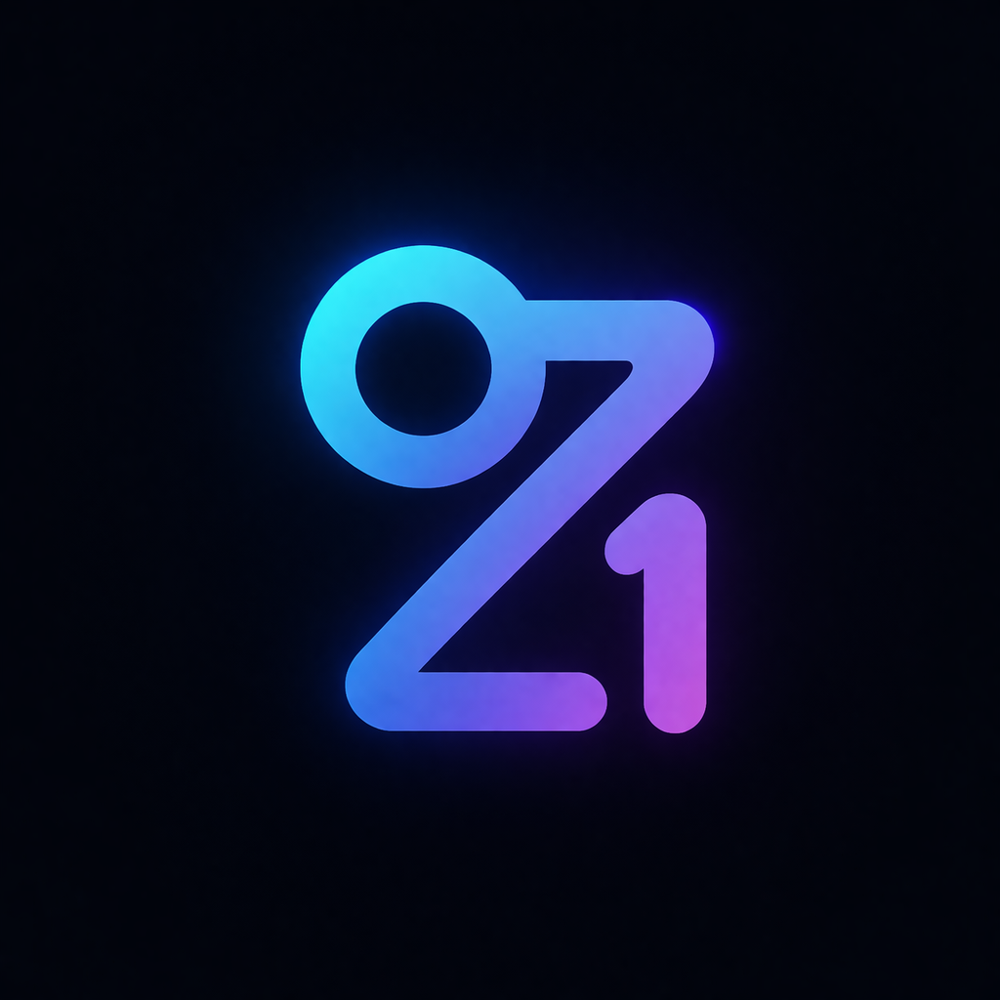

<p align="center">
  
</p>

# ZDS

ZDS는 토큰, 컴포넌트 계약, Pencil 기준선, React 구현, 문서 사이트를 한 저장소에서 관리하는 디자인 시스템 모노레포입니다.

현재 포함 범위:
- foundation color/spacing/radius/typography tokens
- `Button` 컴포넌트 계약, React 구현, 테스트
- Next.js 기반 docs 사이트
- Storybook 기반 컴포넌트 프리뷰
- `.pen` 기준선 자산
- parity 메타데이터와 향후 플랫폼 구현용 패키지 루트

## 구조

```text
apps/
  docs/                  Next.js App Router 문서 사이트
packages/
  foundation/            브랜드 자산과 foundation 공용 에셋
  tokens/                디자인 토큰 패키지
  react/                 React 컴포넌트 구현
  swiftui/               SwiftUI 구현 루트
  kotlin/                Kotlin 구현 루트
  windows/               Windows 구현 루트
.storybook/              Storybook 설정
pen/
  components/            컴포넌트 Pencil 기준선
  docs/                  문서 UI Pencil 기준선
spec/
  components/            배포 가능한 컴포넌트 계약(JSON spec)
  metadata/parity/       플랫폼 parity / exception 메타데이터
specs/                   feature 단위 작업 문서(spec-kit 산출물)
testing/
  docs/                  docs/storybook 검증
  spec/                  계약 검증
  tokens/                토큰 검증
tools/                   저장소 자동화 및 설정 보조
```

## Source Of Truth

컴포넌트는 아래 순서로 이해하면 됩니다.

1. `spec/`
   컴포넌트 계약, parity 의도, 예외 메타데이터
2. `packages/tokens/`, `packages/foundation/`
   시맨틱/컴포넌트 토큰과 재사용 foundation 자산
3. `pen/`
   시각 기준선
4. `packages/react/`, `packages/swiftui/`, `packages/kotlin/`, `packages/windows/`
   플랫폼 구현 계층
5. `apps/docs/`, `Storybook`
   설명과 프리뷰 계층

대표 예시:
- Button contract: [button.spec.json](/home/choiho/zerone/ZDS/spec/components/button/button.spec.json)
- Button tokens: [button.json](/home/choiho/zerone/ZDS/packages/tokens/data/components/button.json)
- Button pen: [button.pen](/home/choiho/zerone/ZDS/pen/components/button/button.pen)
- Docs pen: [design-system-docs.pen](/home/choiho/zerone/ZDS/pen/docs/design-system-docs.pen)
- React Button: [Button.tsx](/home/choiho/zerone/ZDS/packages/react/src/components/button/Button.tsx)

## 시작하기

필수 환경:
- Node.js 20+
- pnpm 10+

설치:

```bash
pnpm install
```

개발 서버:

```bash
pnpm docs:dev
pnpm storybook
```

기본 주소:
- Docs: `http://localhost:3000`
- Storybook: `http://localhost:6006`

포트 충돌 시 Next나 Storybook이 다른 포트로 자동 이동할 수 있습니다.

## 주요 명령

```bash
pnpm build
pnpm dev
pnpm clean

pnpm docs:dev
pnpm docs:build

pnpm storybook
pnpm storybook:build

pnpm validate:tokens
pnpm validate:button-spec
pnpm test:button-react
pnpm validate:button
pnpm validate:docs-system
```

## 문서와 프리뷰

문서와 프리뷰는 역할이 다릅니다.

- `apps/docs`
  공식 문서 앱. 여기서 말하는 docs는 이 Next.js 사이트를 뜻합니다.
- `Storybook`
  variant, size, state, args 기반 인터랙티브 검토

둘 다 사용자-facing surface지만 source of truth 는 아닙니다. 계약은 `spec/`,
시각 값은 `packages/tokens/`, 시각 기준선은 `pen/` 에서 먼저 정의해야 합니다.

문서 기준선은 [design-system-docs.pen](/home/choiho/zerone/ZDS/pen/docs/design-system-docs.pen) 에 있습니다. 현재 docs 홈과 `Button` 상세 페이지 구조가 들어 있고, 컬러는 foundation semantic token에 맞춘 Pencil 변수로 연결돼 있습니다.

## 현재 구현된 컴포넌트

### Button

포함 항목:
- variant: `primary`, `secondary`, `tertiary`, `destructive`
- size: `small`, `medium`, `large`
- state: `default`, `disabled`, `loading`, `focus`, `hover`, `pressed`
- leading/trailing icon support
- spec, tokens, `.pen`, docs, Storybook, React test

관련 파일:
- [button.spec.json](/home/choiho/zerone/ZDS/spec/components/button/button.spec.json)
- [button.md](/home/choiho/zerone/ZDS/apps/docs/content/components/button.mdx)
- [Button.stories.tsx](/home/choiho/zerone/ZDS/packages/react/src/components/button/Button.stories.tsx)
- [Button.test.tsx](/home/choiho/zerone/ZDS/packages/react/src/components/button/Button.test.tsx)

## 브랜드 자산

로고 자산은 foundation 아래에 정리합니다.

- [zds-logo-light.png](/home/choiho/zerone/ZDS/packages/foundation/assets/brand/zds-logo-light.png)
- [zds-logo-dark.png](/home/choiho/zerone/ZDS/packages/foundation/assets/brand/zds-logo-dark.png)
- [zds-logo-light-transparent.png](/home/choiho/zerone/ZDS/packages/foundation/assets/brand/zds-logo-light-transparent.png)
- [zds-logo-dark-transparent.png](/home/choiho/zerone/ZDS/packages/foundation/assets/brand/zds-logo-dark-transparent.png)

## 검증 원칙

- 토큰은 `testing/tokens/validate-tokens.mjs`로 검증
- 컴포넌트 계약은 `testing/spec/validate-button-spec.mjs`로 검증
- React 구현은 Node test runner로 검증
- docs와 Storybook은 정적 빌드 후 검증 스크립트로 확인
- CI에서 docs system 검증과 token 검증이 자동 실행됨

## 워크플로

새 컴포넌트를 추가할 때 권장 순서:

1. `spec/`에 계약 정의
2. `packages/tokens/`에 컴포넌트 토큰 추가
3. `pen/components/`에 기준선 추가
4. `packages/react/`에 구현과 테스트 추가
5. `apps/docs/`와 Storybook 연결
6. validation 스크립트와 CI에 연결
7. parity 메타데이터가 바뀌면 `spec/metadata/parity/` 갱신

## 참고

- feature 작업 문서는 `specs/` 아래에 남깁니다.
- docs UI를 먼저 손볼 때도, 가능하면 `pen/docs/` 기준선을 먼저 갱신한 뒤 코드에 반영하는 흐름을 권장합니다.
